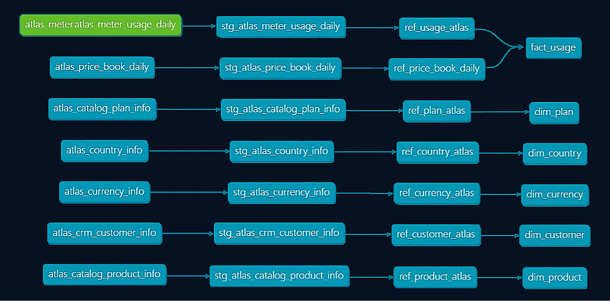

<h1 align="center">Ledgerline: Margin & Growth Analytics</h1>

  Transform raw subscription usage into revenue, margin, and growth insights with dbt and Snowflake.
    

## Business Story

Ledgerline models the commercial core of **Atlas**, a developer-facing B2B SaaS platform.

Customers subscribe to products on plans that include some usage. When they exceed included usage, they pay **overages**.  

Each day, a **price book** sets the unit rate for each product and plan.  

Each night, the metering system emits a **usage log**: what customers did that day.

> *Customer X made 12,000 API calls on 2025-09-16.*

> *Customer Y processed 250,000 ETL rows on the same day.*

Ledgerline turns that feed into a clean, queryable star schema and uses it to answer real commercial questions.

---

## Data Flow and Lineage

Ledgerline transforms raw usage through three layers:

Staging → Refined → Marts

### Flow Summary

Staging normalizes and deduplicates raw feeds; refined exposes clean dimensions/facts with consistent naming; marts publish contract-ready tables.

[View interactive docs](https://moveeleven-data.github.io/ledgerline/site/index.html)

---

## Atlas Data Model

Atlas is modeled as a star schema.

**One fact table** captures daily subscription usage and billing.  
**Five conformed dimensions** provide business context (customer, product, plan, country, currency).

---

### Core tables at a glance

| Model | Purpose | Grain |
|---|---|---|
| `stg_atlas_meter_usage_daily` | Ingest daily metered usage | one row per customer × product × plan × date (latest record) |
| `ref_usage_atlas` | Thin wrapper for usage staging | same grain; adds `overage_units` and stable `*_key` columns |
| `fact_usage` | Business fact table with pricing | one row per `customer_key` × `product_key` × `plan_key` × `report_date` |

---

## Example deliverable: Plan change recommendations

This is the main example output produced from Ledgerline’s star schema.

**Question:** Which customers should change plans next quarter?  
**Window:** 2025-06-30 to 2025-09-28 (90 days)  
**Output:** One recommendation per customer: **upsell / adjust units / hold**

<strong>View the report</strong>

 

### Over-limit behavior (by plan)

*Share of customers by longest over-limit streak bucket (90-day window).*

---

### Recommended actions

<strong>Show recommendation table</strong>

 

| customer_name       | product_name | plan_name         | overage_share | overage_rate | avg_utilization | recommendation |
|---------------------|--------------|-------------------|---------------|--------------|-----------------|----------------|
| Horizon Media       | Alerting     | Alerting Standard | 1.05          | 1.0          | N/A             | upsell         |
| Delta Manufacturing | Alerting     | Alerting Standard | 0.97          | 0.87         | N/A             | upsell         |
| Nimbus Cloud        | Core API     | Basic             | 0.45          | 1.0          | 1.83            | upsell         |
| Global Insights     | ETL Engine   | ETL 100k rows     | 0.43          | 1.0          | 1.76            | upsell         |
| Crescent Health     | ETL Engine   | ETL 100k rows     | 0.38          | 1.0          | 1.60            | upsell         |
| River City Bank     | Core API     | Basic             | 0.35          | 1.0          | 1.55            | upsell         |
| Acme Analytics      | Core API     | Basic             | 0.33          | 1.0          | 1.49            | upsell         |
| Falcon Labs         | Core API     | Pro               | 0.19          | 1.0          | 1.23            | upsell         |
| Evergreen Retail    | Core API     | Basic             | 0.06          | 0.43         | 1.03            | adjust units   |
| Ivy Systems         | Core API     | Basic             | 0.01          | 0.43         | 1.00            | adjust units   |
| Blue Rocket         | Core API     | Pro               | 0.00          | 0.00         | 0.90            | hold           |
| Jade Foods          | Core API     | Basic             | 0.00          | 0.00         | 0.81            | hold           |
| Sunrise Telecom     | Core API     | Pro               | 0.00          | 0.00         | 0.68            | hold           |

CSV export: [plan_change_recommendations_90d.csv](docs/eda/plan_change_recommendations_90d.csv)

---

### Fairness by country and plan

<strong>Show fairness table</strong>

 

| country       | plan_name | sample_size | days_over_limit_rate | plan_days_over_limit_rate | delta | severity |
|---------------|-----------|-------------|----------------------|----------------------------|-------|----------|
| United States | Basic     | 2           | 1.00                 | 0.74                       | 0.26  | alert    |

---

### Price volatility by plan

<strong>Show price volatility table</strong>

 

| product_name | plan_name         | distinct_unit_prices | volatility_level | total_billed_value |
|--------------|-------------------|----------------------|------------------|--------------------|
| Core API     | Basic             | 1                    | stable           | 1155.53            |
| Core API     | Pro               | 1                    | stable           | 504.45             |
| ETL Engine   | ETL 100k rows     | 1                    | stable           | 4031.2             |
| Alerting     | Alerting Standard | 1                    | stable           | 13.95              |

---

### SQL used

- [`analyses/eda/usage_limit_behavior_profile.sql`](analyses/eda/usage_limit_behavior_profile.sql)
- [`analyses/eda/plan_change_recommendations_90d.sql`](analyses/eda/plan_change_recommendations_90d.sql)
- [`analyses/eda/fairness_by_country_and_plan.sql`](analyses/eda/fairness_by_country_and_plan.sql)
- [`analyses/eda/billed_amount_price_volatility.sql`](analyses/eda/billed_amount_price_volatility.sql)

---

## Data Assurance

dbt’s built-in tests guard the ingestion edges and marts, QuerySurge provides an external smoke suite around the Snowflake models, and a GitHub Actions workflow runs `dbt build` against dedicated CI schemas on every pull request into `main`.

[Data Quality and Assurance Strategy](docs/testing_strategy.md)

---

## Codebase Overview

  **[models/](models/)** - core transformation layers.  
  - **sources/** - declares runtime sources (Atlas metering feed).  
  - **staging/** - normalizes seeds/sources, deduplicates, adds surrogate keys.
  - **refined/** - exposes clean dimensions/facts with consistent naming.  
  - **marts/usage/** - publishes the Usage Mart.

  **[macros/](macros/)** - reusable utilities.  
  - **core/** - pure helpers (date normalization, string cleanup).
  - **dev_utils/** - local iteration helpers (insert/delete test rows).
  - **migrations/** - versioned DDL.  
  - **tests/** - generic test definitions.

  **[seeds/](seeds/)** - versioned reference CSVs.

  **[analyses/](analyses/)** - ad-hoc SQL.  
  - **qa/** - audit probes and diagnostics.  
  - **dev/** - scratch queries for local iteration and macro testing.

  **[tests/](tests/)** - singular tests.

  **[docs/](docs/)** - ERDs, diagrams, and BI references.

---

Designed and maintained by <a href="https://github.com/moveeleven-data">Matthew Tripodi</a>

