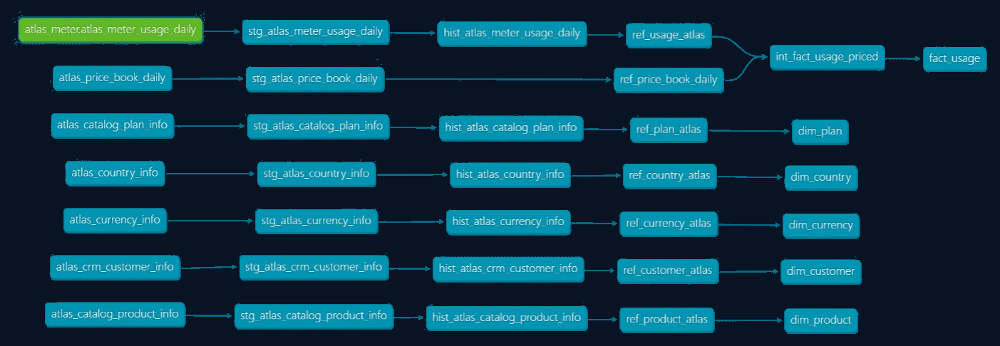

<h1 align="center">Ledgerline: Margin & Growth Analytics</h1>

  Transform raw subscription usage into revenue, margin, and growth insights with dbt and Snowflake.
    

## Business Story

Ledgerline models the commercial core of **Atlas**, a B2B SaaS company.

It turns product usage into revenue and margin that finance and product can trust.

Customers subscribe to products, get a bundle of included usage, and pay overage once they cross that threshold.  

Atlas offers three core services: 
- **PROD-API** - Lets customers call the Atlas API  
- **PROD-ETL** - Lets customers process data rows  
- **PROD-ALRT** - Lets customers send alerts and notifications  

Pricing is not static. Each day, a price book sets the unit rate for each product and plan.  

And, every night, the metering system emits a usage log, a running tally of what customers actually did.

> *Customer X made 12,000 API calls on 2025-09-16.*  

> *Customer Y processed 250,000 ETL rows on the same day.*  

Ledgerline transforms that feed into a **star schema**, a daily usage fact table connected to five dimensions.  

The star schema makes the business questions easy to answer:  
- **Finance** can see recurring revenue and how much comes from overages.  
- **Product** can see which services are growing and how pricing changes affect usage.  
- **Customer Success** can see which accounts are hitting limits, showing upsell chances or churn risk.  
- **Executives** can see growth by region and the impact of new products like Alerts.  

---

## Data Flow and Lineage

Ledgerline transforms raw usage through five layers:

Sources  →  Staging  →  History  →  Refined  →  Fact

### Flow Summary

**Sources** load metering, catalog, and customer data.  

**History** captures daily state changes.  

**Refined** produces stable dimensions.  

**Fact** joins usage, pricing, and currency into one view.  

[View interactive docs (Public)](https://moveeleven-data.github.io/ledgerline/site/index.html)

---

## Atlas Data Model

Atlas runs on a **star schema**.

At the core, one fact table logs daily subscription usage and billing. It captures units consumed, plan coverage, and overages.

It is the system of record for turning activity into dollars.  

Five conformed dimensions provide context:  
- **Customer** - identity and geography  
- **Product & Plan** - the commercial catalog  
- **Currency** - consistent amounts  
- **Country** - rollups by market

The diagram below shows how the fact and dimensions connect into a simple, reliable model.

Atlas reduces everything to one clear structure: daily activity measured and explained.

Every team sees the **same story** in the **same numbers**.

From raw usage to revenue, nothing gets lost in translation.

---

## Case Study: Plan Recommendations

Real impact lies in translating usage into answers.

The analysis is framed by a single question:

**Which customers should receive a plan recommendation next quarter?**

The intent is to right-size plans so they match actual use. The aim is to give customers a better fit while keeping the business healthy.

### Further Reading

[Recommendations report](reports/plan_change_recommendations.md)  

---

## Codebase Overview

  **[models/](models/)** - core transformation layers.  
  - **sources/** - declares runtime sources (Atlas metering feed).  
  - **staging/** - normalizes seeds/sources, deduplicates, adds surrogate keys.  
  - **history/** - persists full change logs (SCD2 reference history).  
  - **refined/** - collapses history into current views.  
  - **marts/usage/** - publishes the Usage Mart.

  **[macros/](macros/)** - reusable utilities.  
  - **core/** - pure helpers (date normalization, string cleanup).  
  - **delivery/** - presentation utilities (self-completing dimensions).  
  - **dev_utils/** - local iteration helpers (insert/delete test rows).  
  - **history/** - toolkit for state persistence.  
  - **migrations/** - versioned DDL.  
  - **tests/** - generic test definitions.

  **[seeds/](seeds/)** - versioned reference CSVs.

  **[analyses/](analyses/)** - ad-hoc SQL.  
  - **qa/** - audit probes and diagnostics.  
  - **dev/** - scratch queries for local iteration and macro testing.

  **[tests/](tests/)** - singular tests.

  **[docs/](docs/)** - ERDs, diagrams, and BI references.

---

Designed and maintained by <a href="https://github.com/moveeleven-data">Matthew Tripodi</a>

