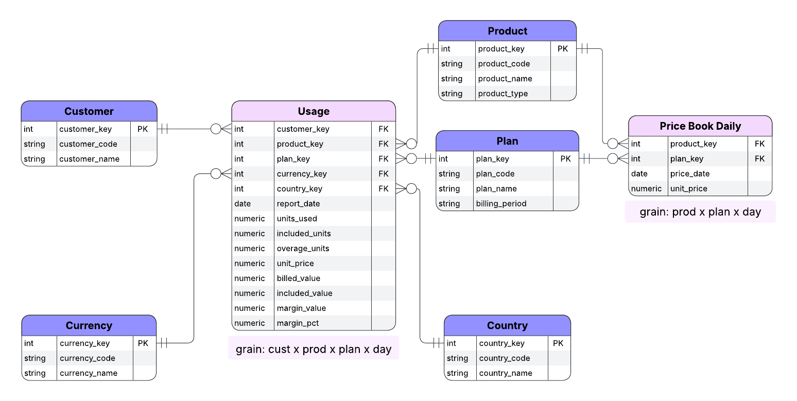

<h1 align="center">LedgerLine: Subscription Usage, Billing & Margin Analytics</h1>

<p align="center">
  Accurate, auditable SaaS insights delivered from daily subscription usage with dbt and Snowflake.
  <br/><br/>
</p>

<p align="center">Designed and maintained by <a href="https://github.com/moveeleven-data">Matthew Tripodi</a></p>

---

## Key Features

| Capability | What you get |
|------------|--------------|
| **Layered modeling** | Staging → history → refined → marts, with clear separation of concerns |
| **Slowly changing dimensions** | History tables via custom `save_history` macro |
| **Default key strategy** | Self-completing dimensions guarantee referential integrity |
| **Business metrics** | Daily usage, billed amounts, overage, and margin percentage |
| **Data quality** | Tests for hash collisions, default key rules, valid dates and bounds |

---

## Architecture

### Data Flow

Usage and reference data land in staging, history retains changes, refined computes current views and billing logic, marts publish the dimensional star schema.

### Schema
  
**fact_usage** records daily subscription activity and joins to five dimensions.  
  
**fact_price_book_daily** records daily effective unit prices by product and plan.



---

## Quickstart

**Prereqs:**  
- Snowflake account  
- dbt CLI or dbt Cloud  

### 1. Configure Snowflake

Run the setup script (or inline SQL) to create dev/prod databases, schemas, and a `dbt_executor_role` with least-privilege grants. Example:

```sql
create database if not exists ledgerline_dev;
create database if not exists ledgerline_prod;

create schema if not exists ledgerline_dev.source_data;
create schema if not exists ledgerline_dev.staging;
create schema if not exists ledgerline_dev.history;
create schema if not exists ledgerline_dev.refined;
create schema if not exists ledgerline_dev.marts;

create warehouse if not exists ledgerline_wh
  with warehouse_size = xsmall auto_suspend = 60 auto_resume = true;

create role if not exists dbt_executor_role;
```

### 2. Load Sample Data

Put CSVs in the repo under ./seeds: customers.csv, products.csv, plans.csv, currencies.csv, countries.csv, 
price_book_daily.csv, usage_daily.csv

```sql
dbt seed
```

The source YAML enforces freshness and a unique natural key on (customer, product, plan, report_date).

### 3. Run dbt

Install dependencies and run a build:

```bash
dbt deps
dbt seed
dbt build
```

### 4. Explore

Open dbt docs to browse models, lineage, and freshness:

```bash
dbt docs generate && dbt docs serve
```

## Project Layout

**models/staging/**  
- Standardize sources and seeds, generate surrogate keys, add defaults.

**models/history/**  
- Incremental history via `save_history`, including synthetic closes for churned subscriptions.

**models/refined/**  
- Current views, billing and margin metrics, and an invalid rows view for QA.

**models/marts/usage/**  
- Star schema dimensions and `fact_usage`, with uniqueness and relationships tests.

**macros/**  
- Core, history, and test macros including self-completing dimensions and hash-collision checks.

**seeds/**  
- Reference CSVs for customers, products, plans, currencies, and price books.

**docs/**  
- Images, ERDs, and future BI screenshots.