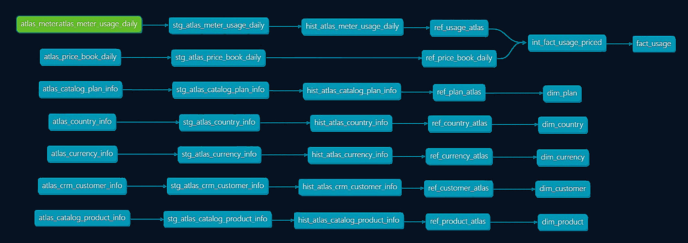

<h1 align="center">Ledgerline: Margin & Growth Analytics</h1>

  Transform raw subscription usage into revenue, margin, and growth insights with dbt and Snowflake.
    

## Business Story

Ledgerline models the commercial core of Atlas, a B2B SaaS company that turns product usage into revenue and margin KPIs.

Customers subscribe to products, get a bundle of included usage, and pay overage once they cross that threshold.  

Atlas offers three core services: 
- PROD-API - Lets customers call the Atlas API  
- PROD-ETL - Lets customers process data rows  
- PROD-ALRT - Lets customers send alerts and notifications  

Pricing is not static. Each day, a price book sets the unit rate for each product and plan.  

Every night, the metering system emits a usage log, a running tally of what customers did.

> *Customer X made 12,000 API calls on 2025-09-16.*  

> *Customer Y processed 250,000 ETL rows on the same day.*  

Ledgerline transforms that feed into a star schema, a daily usage fact table connected to five dimensions.  

---

## Data Flow and Lineage

Ledgerline transforms raw usage through three layers:

Storage → Refinement → Delivery

> *Note: The Price Book doesn’t need a separate history table since `price_date` already tracks change over time.*

### Flow Summary

**Sources** load metering, catalog, and customer data.
  
**Storage** (includes staging + history) stages and versions inputs for an immutable record.

**Refinement** applies business rules to form reusable concepts.

**Delivery** publishes marts, including a unified usage, pricing, and currency fact.  

[View interactive docs](https://moveeleven-data.github.io/ledgerline/site/index.html)

---

## Atlas Data Model

Atlas runs on a star schema. One fact table logs daily subscription usage that captures units consumed, plan coverage, and overages.

Five conformed dimensions provide context:  
- **Customer** - identity and geography  
- **Product & Plan** - the commercial catalog  
- **Currency** - consistent amounts  
- **Country** - rollups by market

Atlas reduces everything to one structure: daily activity measured and explained.

---

## Case Study: Plan Recommendations

Real impact lies in translating usage into answers. The analysis is framed by a single question:

**Which customers should receive a plan recommendation next quarter?**

The intent is to right-size plans so they match actual use. The aim is to give customers a better fit while keeping the business healthy.

[Recommendations report](reports/plan_change_recommendations.md)  

---

## Data Assurance

dbt’s built-in tests guard the ingestion edges and marts, QuerySurge provides an external smoke suite around the Snowflake models, and a GitHub Actions workflow runs `dbt build` against dedicated CI schemas on every pull request into `main`.

[Data Quality and Assurance Strategy](docs/testing_strategy.md)

---

## Codebase Overview

  **[models/](models/)** - core transformation layers.  
  - **sources/** - declares runtime sources (Atlas metering feed).  
  - **staging/** - normalizes seeds/sources, deduplicates, adds surrogate keys.  
  - **history/** - persists full change logs (SCD2 reference history).  
  - **refined/** - collapses history into current views.  
  - **marts/usage/** - publishes the Usage Mart.

  **[macros/](macros/)** - reusable utilities.  
  - **core/** - pure helpers (date normalization, string cleanup).  
  - **delivery/** - presentation utilities (self-completing dimensions).  
  - **dev_utils/** - local iteration helpers (insert/delete test rows).  
  - **history/** - toolkit for state persistence.  
  - **migrations/** - versioned DDL.  
  - **tests/** - generic test definitions.

  **[seeds/](seeds/)** - versioned reference CSVs.

  **[analyses/](analyses/)** - ad-hoc SQL.  
  - **qa/** - audit probes and diagnostics.  
  - **dev/** - scratch queries for local iteration and macro testing.

  **[tests/](tests/)** - singular tests.

  **[docs/](docs/)** - ERDs, diagrams, and BI references.

---

Designed and maintained by <a href="https://github.com/moveeleven-data">Matthew Tripodi</a>

