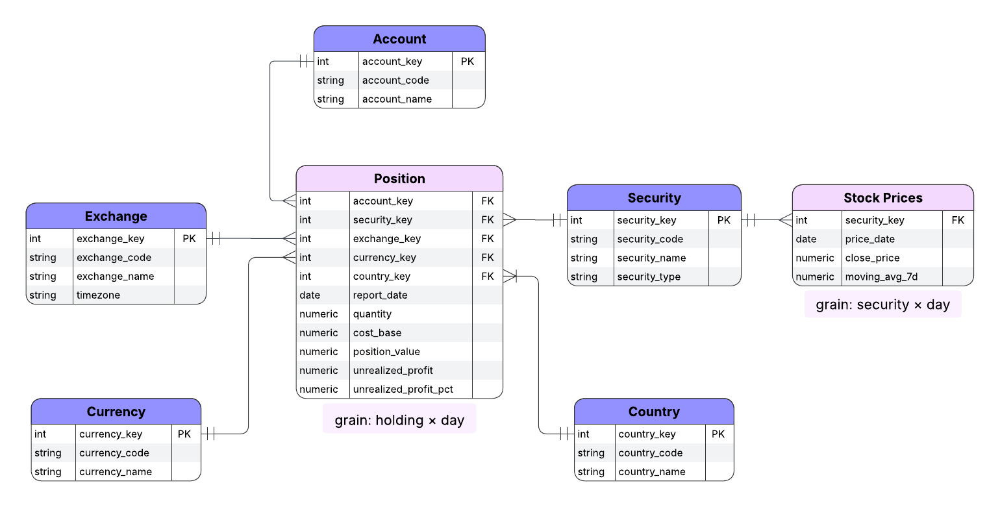

<h1 align="center">MarketSync: Portfolio Analytics & Modeling</h1>

<p align="center">
  Accurate, auditable portfolio insights delivered from raw positions using dbt and Snowflake.
  <br/><br/>
</p>

<p align="center">Adapted from Roberto Zagni’s <em>Data Engineering with dbt</em>, extended and maintained by <a href="https://github.com/moveeleven-data">Matthew Tripodi</a></p>

---

## Key Features

| Capability | What you get |
|------------|--------------|
| **Layered modeling** | Staging → history → refined → marts, with clear separation of concerns |
| **Slowly changing dimensions** | History tables via custom `save_history` macro |
| **Default key strategy** | Self-completing dimensions guarantee referential integrity |
| **Business metrics** | Current positions with unrealized profit and percentage |
| **Data quality** | 	Tests for hash collisions, default key rules, valid dates and bounds |

---

## Architecture

### Data Flow

Positions and reference data land in staging, history retains changes, refined computes current views and P&L, marts publish the dimensional star schema.

### Schema
  
**fact_position** records daily holdings and joins to five dimensions.  
  
**fact_stock_prices** records daily closes by security.



---

## Quickstart

**Prereqs:**  
- Snowflake account  
- dbt CLI or dbt Cloud  

### 1. Configure Snowflake

Run the setup script (or inline SQL) to create dev/prod databases, schemas, and a `dbt_executor_role` with least-privilege grants. Example:

```sql
create database if not exists market_sync_dev;

create schema if not exists market_sync_dev.source_data;
create schema if not exists market_sync_dev.staging;
create schema if not exists market_sync_dev.history;
create schema if not exists market_sync_dev.refined;
create schema if not exists market_sync_dev.marts;

create warehouse if not exists market_sync_wh
  with warehouse_size = xsmall auto_suspend = 60 auto_resume = true;

create role if not exists dbt_executor_role;
```

### 2. Load Sample Data

Stage a CSV of positions and load it into the landing table:

```sql
copy into source_data.abc_bank_position
from @positions_stage/positions_sample.csv
file_format = (type = csv, skip_header = 1);
```

Your source YAML enforces freshness and a unique natural key on (accountid, symbol, exchange, report_date). 

### Run dbt

Install dependencies and run a build:

```bash
dbt deps
dbt seed
dbt build
```

### 4. Explore

Open dbt docs to browse models, lineage, and freshness:

```bash
dbt docs generate && dbt docs serve
```

---

### Project Layout

- **[models/staging/](models/staging/)** - Standardize sources and seeds, generate surrogate keys, add defaults.

- **[models/history/](models/history/)** - Incremental history via `save_history`, including synthetic closes for positions.

- **[models/refined/](models/refined/)** - Current views, unrealized metrics, and an invalid rows view for QA.

- **[models/marts/portfolio/](models/marts/portfolio/)** - Star schema dimensions and `fact_position`, with uniqueness and relationships tests.

- **[macros/](macros/)** - Core, history, and test macros including self-completing dimensions and hash-collision checks.

- **[seeds/](seeds/)** - Reference CSVs for accounts, countries, currencies, exchanges, securities.

- **[snapshots/](snapshots/)** - Optional SCD2 snapshots (kept off by default).

- **[docs/](docs/)** - Images, ERDs, and future BI screenshots.
