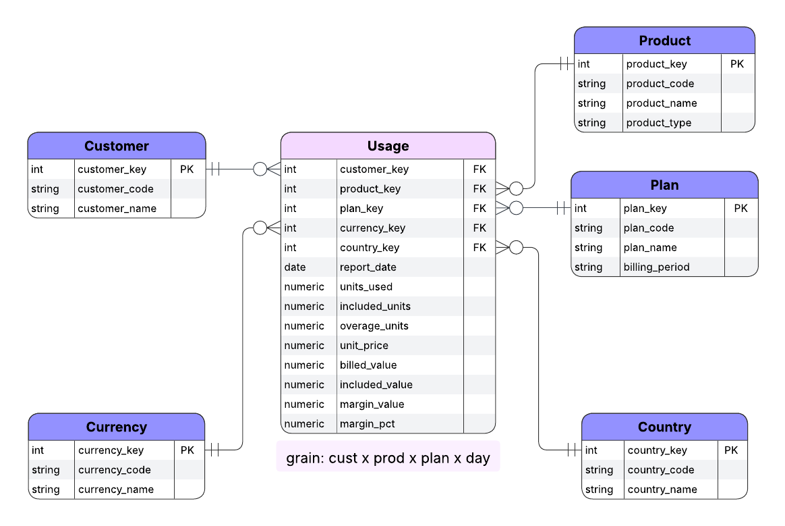

<h1 align="center">Ledgerline: Margin & Growth Analytics</h1>

  Transform raw subscription usage into revenue, margin, and growth insights with dbt and Snowflake.
    

## Business Story

Ledgerline simulates the financial heartbeat of a fictional B2B SaaS platform called **Atlas**. 

Customers subscribe to products, get a bundle of included usage, and pay overage once they cross that threshold.  

The core services are:  
- **PROD-API** - Every API call counts toward your bill
- **PROD-ETL** - Rows processed in the pipeline
- **PROD-ALRT** - Alerts or notifications sent

Pricing isn’t fixed. A **daily price book** sets the unit rate for each product and plan.  

Every night, the metering system emits a **usage feed**:

- *Customer X made 12,000 API calls on 2025-09-16.*  
- *Customer Y processed 250,000 ETL rows on the same day.*  

The Usage fact table records daily subscription activity and joins to five dimensions.  

The star schema is what makes the business questions answerable:  
- **Finance** sees recurring revenue and how much comes from overages.
- **Product** tracks which services drive growth and how pricing changes shift usage.
- **Customer Success** spots accounts hitting limits (upsell potential) or showing churn risk.
- **Executives** view growth by region and the impact of new products like Alerts.

---

## Atlas Data Model

The core of Atlas is a **star schema**:  
one fact table (**fact_usage**) that records daily subscription activity,  
joined to five conformed dimensions (customer, product, plan, currency, country).

Pricing is modeled as a refined lookup table and joined during fact construction, not exposed as its own mart.

---

## Project Layout

- **[models/staging/](models/staging/)** - Standardizes sources and seeds, generates surrogate keys, and applies defaults.

- **[models/history/](models/history/)** - Builds incremental history, including synthetic closes for churned subscriptions.

- **[models/refined/](models/refined/)** - Produces current views, billing and margin metrics.

- **[models/marts/usage/](models/marts/usage/)** - Defines the dimensions and `fact_usage`, with uniqueness and relationship tests.

- **[macros/](macros/)** - Core, history, and test macros, including self-completing dimensions and hash-collision checks.

- **[seeds/](seeds/)** - Reference CSVs for customers, products, plans, currencies, and price books.

- **[docs/](docs/)** - Reference assets, such as ERDs, images, and future BI screenshots.

Designed and maintained by <a href="https://github.com/moveeleven-data">Matthew Tripodi</a>

