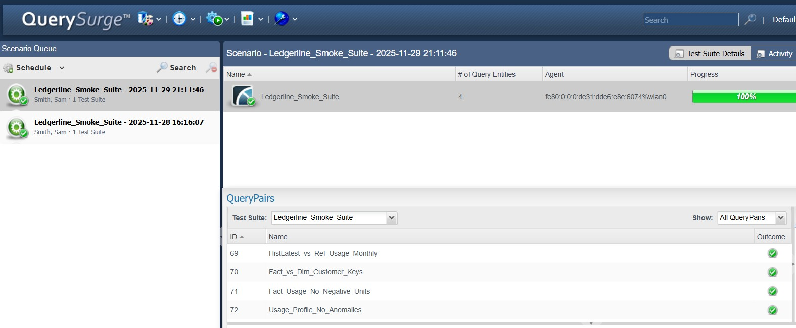

# Testing Strategy

In Ledgerline I use a testing strategy that focuses on protecting the boundaries of the data flow, rather than exhaustively testing every transformation step in the middle. That means the strongest tests live where data enters the system and where data is consumed. At the ingestion edge, I validate grain, uniqueness, nullability, accepted values, and basic relational integrity so that upstream drift shows up immediately. If the source feed duplicates usage rows, if a catalog file drops a plan code, or if a price book arrives incomplete, those issues surface right away. This follows Zagni’s principle that early, precise failures are more valuable than sprawling test suites scattered throughout intermediate layers.

In the history models, I validate that each natural key produces a stable surrogate key, that version hashes behave consistently, and that no unexpected duplicates appear at the grain of (usage_hkey, report_date). Because Ledgerline’s history is append-only, the goal is simply to ensure changes are detected correctly and that incremental loads behave predictably. In the refined layer, I check that surrogate keys and natural keys stay aligned, that default keys don’t leak in unexpectedly, and that dimensions remain referentially clean.

At the consumption side, I tighten validation because these models behave as data contracts for the outside world. Mart models enforce schema contracts and grain contracts (unique combinations of the dimension keys). Any incompatible change fails the build early. The overall strategy is strong, defensive tests at the edges; structural and rule-based checks in the middle; and contract-level guarantees at the end. It scales across projects because it respects the natural flow of data and puts testing effort exactly where it catches the most meaningful failures.

---

## External Data Testing with QuerySurge

On top of dbt’s built-in tests, Ledgerline uses QuerySurge as an external test harness around the Snowflake warehouse. A dedicated, read-only Snowflake service user (key-pair authenticated, no MFA) connects QuerySurge to the `LEDGER_LINE_DEV` database and runs a focused smoke suite after each dbt run.

The **`Ledgerline_Smoke_Suite`** currently covers three main areas:

- **History → refined reconciliation**  
  A flagship QueryPair (`HistLatest_vs_Ref_Usage_Monthly`) recomputes the “latest row per usage key” directly from the history table and compares monthly counts and sums to the refined usage view. This confirms that the history logic and refined layer stay in sync.

- **Fact → dimension integrity**  
  A small cluster of QueryPairs checks that every key in `FACT_USAGE` has a matching row in the core dimensions (customer, product, plan, currency, country). These are simple distinct-key comparisons that catch missing or mis-joined dimension rows early.

- **Business-rule guards**  
  Additional QueryPairs enforce non-negotiable rules like “no negative usage.” These are written so that any violating rows show up directly in the QuerySurge result grid for quick inspection.

The suite is wired **inline with the pipeline**: a script runs `dbt run` and `dbt test` and then automatically triggers `Ledgerline_Smoke_Suite` via the QuerySurge CLI. This keeps external validation tied to the same cadence as model changes instead of being a separate, ad-hoc activity.

To make results observable over time, each run writes a simple record into a `DQ_EVENTS` table in Snowflake (timestamp, check name, status, optional details). This turns data-quality outcomes into first-class data, so it’s easy to see when checks started failing or which ones are noisy.

Finally, Ledgerline includes an early **metadata-driven mapping check**: a small mapping table describes how a staging field (e.g. `units_used` in `stg_atlas_meter_usage_daily`) should roll into the mart (`FACT_USAGE`), and a dbt model uses that metadata to compare source and target aggregates. This is a first step toward automated mapping validation, complementing the hand-written QueryPairs and dbt tests.

