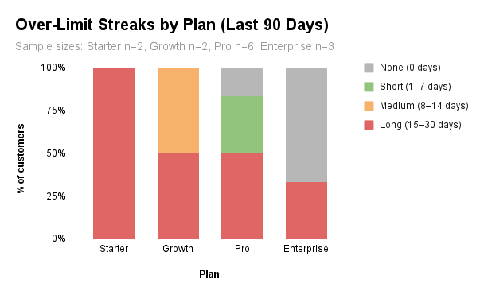

# Plan Change Recommendations

**Scope:** 90 day subscription usage analysis  
**Goal:** Identify customers for plan adjustments that balance fairness and revenue  
**Window:** 2025-08-30 to 2025-09-28

*Figure. Share of customers by longest over limit streak bucket, 90 day window.*  

Sample sizes: Starter n=2, Growth n=2, Pro n=6, Enterprise n=3.

---

## Top targets to action

| customer_name       | product_name | plan_name         | overage_share | overage_rate | avg_utilization | recommendation |
|---------------------|--------------|-------------------|---------------|--------------|-----------------|----------------|
| Horizon Media       | Alerting     | Alerting Standard | 1.05          | 1.0          |                 | upsell         |
| Delta Manufacturing | Alerting     | Alerting Standard | 0.97          | 0.87         |                 | upsell         |
| Nimbus Cloud        | Core API     | Basic             | 0.45          | 1.0          | 1.83            | upsell         |
| Global Insights     | ETL Engine   | ETL 100k rows     | 0.43          | 1.0          | 1.76            | upsell         |
| Crescent Health     | ETL Engine   | ETL 100k rows     | 0.38          | 1.0          | 1.60            | upsell         |
| River City Bank     | Core API     | Basic             | 0.35          | 1.0          | 1.55            | upsell         |
| Acme Analytics      | Core API     | Basic             | 0.33          | 1.0          | 1.49            | upsell         |
| Falcon Labs         | Core API     | Pro               | 0.19          | 1.0          | 1.23            | upsell         |
| Evergreen Retail    | Core API     | Basic             | 0.06          | 0.43         | 1.03            | adjust units   |
| Ivy Systems         | Core API     | Basic             | 0.01          | 0.43         | 1.00            | adjust units   |
| Blue Rocket         | Core API     | Pro               | 0.00          | 0.00         | 0.90            | hold           |
| Jade Foods          | Core API     | Basic             | 0.00          | 0.00         | 0.81            | hold           |
| Sunrise Telecom     | Core API     | Pro               | 0.00          | 0.00         | 0.68            | hold           |

Full table export: [assets/tables/action_table_2025-09-28.csv](assets/tables/action_table_2025-09-28.csv)

Note: avg_utilization is blank for Alerting Standard customers (e.g. Horizon Media, Delta Manufacturing) because their plan does not define included_units.

---

## Fairness check, country and plan

Shown only for country–plan groups with at least two customers and an over-limit rate differing from the plan average by 0.10 or more.

| country       | plan_name | sample_size | days_over_limit_rate | plan_days_over_limit_rate | delta | severity |
|---------------|-----------|-------------|----------------------|----------------------------|-------|----------|
| United States | Basic     | 2           | 1.00                 | 0.74                       | 0.26  | alert    |

All other country–plan groups are either within tolerance or too small to evaluate.

---

## Price volatility snapshot, billed amount vs unit price

| product_name | plan_name         | distinct_unit_prices | volatility_level | total_billed_value |
|--------------|-------------------|----------------------|------------------|--------------------|
| Core API     | Basic             | 1                    | stable           | 1155.53            |
| Core API     | Pro               | 1                    | stable           | 504.45             |
| ETL Engine   | ETL 100k rows     | 1                    | stable           | 4031.2             |
| Alerting     | Alerting Standard | 1                    | stable           | 13.95              |

**Implication:** Pricing is stable across product and plan, so recommended changes are driven by usage behavior rather than price shifts.

---

## SQL reference

`analyses/usage_limit_behavior_profile.sql`  
`analyses/action_table.sql`  
`analyses/fairness_by_country_and_plan.sql`  
`analyses/billed_amount_price_volatility.sql`
