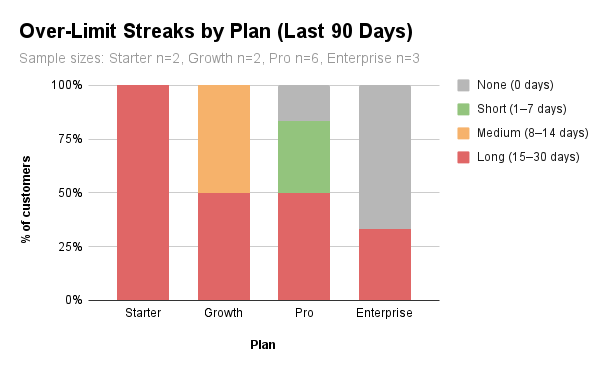

# Plan Change Recommendations (WIP)

**Scope:** 90-day subscription usage analysis.  
**Goal:** Identify customers for plan adjustments to balance fairness and revenue.  

*Figure. Share of customers by longest over-limit streak bucket, 90-day window.*  

Sample sizes: Starter n=2, Growth n=2, Pro n=6, Enterprise n=3.  

**Notes so far:**  
- Starter: All long streaks (likely under-provisioned).
- Growth: Split between medium and long streaks.  
- Pro: Mixed Spread (some short, some long).  
- Enterprise: Many none (possible oversizing).
